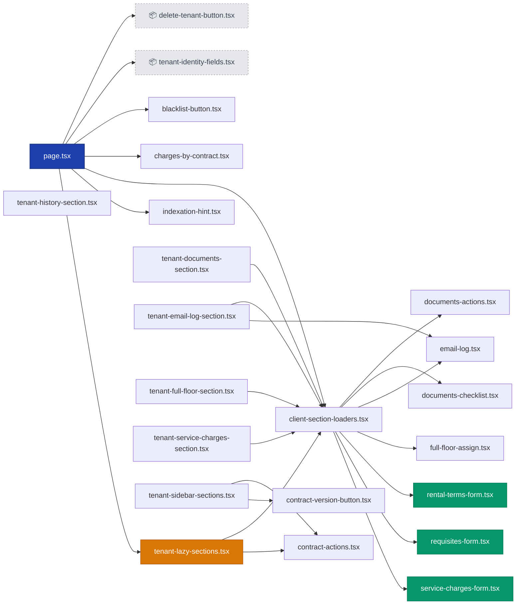

# Карточка арендатора

> Граф зависимостей модулей (импорты TypeScript/React) — автогенерация через `madge` + Mermaid.
> **Источник:** `app/admin/tenants/[id]`
> **Всего файлов:** 23
> **Обновить:** `node scripts/gen-code-graph.mjs "app/admin/tenants/[id]" docs/code-graphs/01-tenant-card.md "Карточка арендатора"`

## Легенда

- 🔵 **Синий** — `page.tsx` (точка входа страницы)
- 🟢 **Зелёный** — формы (`*-form.tsx`)
- 🟠 **Оранжевый** — lazy-секции (динамический импорт)
- ⚫ **Серый** — библиотеки (`lib/`, `.ts`)
- ⚪ **Бледный пунктир** — внешние зависимости (вне таргет-папки)

## Граф

---

*Сгенерировано 2026-05-27. Если граф слишком плотный — открой в Obsidian и используй колесо мыши для zoom (правый клик → Zoom in / Zoom out).*
