# Server actions (app/actions/)

> Граф зависимостей модулей (импорты TypeScript/React) — автогенерация через `madge` + Mermaid.
> **Источник:** `app/actions`
> **Всего файлов:** 58
> **Обновить:** `node scripts/gen-code-graph.mjs "app/actions" docs/code-graphs/02-server-actions.md "Server actions (app/actions/)"`

## Легенда

- 🔵 **Синий** — `page.tsx` (точка входа страницы)
- 🟢 **Зелёный** — формы (`*-form.tsx`)
- 🟠 **Оранжевый** — lazy-секции (динамический импорт)
- ⚫ **Серый** — библиотеки (`lib/`, `.ts`)
- ⚪ **Бледный пунктир** — внешние зависимости (вне таргет-папки)

## Граф

```mermaid
graph LR
  addons_ts["addons.ts"]:::lib
  api_keys_ts["api-keys.ts"]:::lib
  approvals_ts["approvals.ts"]:::lib
  auth_ts["auth.ts"]:::lib
  bank_import_ts["bank-import.ts"]:::lib
  billing_batch_ts["billing-batch.ts"]:::lib
  booking_ts["booking.ts"]:::lib
  building_ts["building.ts"]:::lib
  buildings_ts["buildings.ts"]:::lib
  bulk_notify_ts["bulk-notify.ts"]:::lib
  cash_accounts_ts["cash-accounts.ts"]:::lib
  change_password_ts["change-password.ts"]:::lib
  my_account_ts["my-account.ts"]:::lib
  change_password_ts --> my_account_ts
  complaints_ts["complaints.ts"]:::lib
  contract_workflow_ts["contract-workflow.ts"]:::lib
  contracts_ts["contracts.ts"]:::lib
  document_templates_ts["document-templates.ts"]:::lib
  documents_ts["documents.ts"]:::lib
  faq_ts["faq.ts"]:::lib
  finance_ts["finance.ts"]:::lib
  floor_assignment_ts["floor-assignment.ts"]:::lib
  floor_layout_ts["floor-layout.ts"]:::lib
  import_tenants_ts["import-tenants.ts"]:::lib
  leads_ts["leads.ts"]:::lib
  messages_ts["messages.ts"]:::lib
  meters_ts["meters.ts"]:::lib
  notification_settings_ts["notification-settings.ts"]:::lib
  notifications_ts["notifications.ts"]:::lib
  organization_settings_ts["organization-settings.ts"]:::lib
  organizations_ts["organizations.ts"]:::lib
  password_reset_ts["password-reset.ts"]:::lib
  password_reset_ts --> my_account_ts
  penalties_ts["penalties.ts"]:::lib
  perf_probe_ts["perf-probe.ts"]:::lib
  permissions_ts["permissions.ts"]:::lib
  plans_ts["plans.ts"]:::lib
  requests_ts["requests.ts"]:::lib
  salary_ts["salary.ts"]:::lib
  send_document_ts["send-document.ts"]:::lib
  service_fee_ts["service-fee.ts"]:::lib
  services_ts["services.ts"]:::lib
  signatures_ts["signatures.ts"]:::lib
  signup_ts["signup.ts"]:::lib
  spaces_ts["spaces.ts"]:::lib
  staff_ts["staff.ts"]:::lib
  storage_ts["storage.ts"]:::lib
  superadmin_addons_ts["superadmin-addons.ts"]:::lib
  superadmin_errors_ts["superadmin-errors.ts"]:::lib
  superadmin_founders_ts["superadmin-founders.ts"]:::lib
  superadmin_users_ts["superadmin-users.ts"]:::lib
  tariffs_ts["tariffs.ts"]:::lib
  tasks_ts["tasks.ts"]:::lib
  tenant_create_ts["tenant-create.ts"]:::lib
  tenant_docs_ts["tenant-docs.ts"]:::lib
  tenant_payments_ts["tenant-payments.ts"]:::lib
  tenant_ts["tenant.ts"]:::lib
  test_email_ts["test-email.ts"]:::lib
  two_factor_ts["two-factor.ts"]:::lib
  users_ts["users.ts"]:::lib

  classDef page    fill:#1e40af,color:#fff,stroke:#1e3a8a,stroke-width:2px
  classDef form    fill:#059669,color:#fff,stroke:#047857
  classDef lazy    fill:#d97706,color:#fff,stroke:#b45309
  classDef lib     fill:#6b7280,color:#fff,stroke:#4b5563
  classDef external fill:#e5e7eb,color:#374151,stroke:#9ca3af,stroke-dasharray:3 3
```

---

*Сгенерировано 2026-05-27. Если граф слишком плотный — открой в Obsidian и используй колесо мыши для zoom (правый клик → Zoom in / Zoom out).*
