# Библиотеки core (lib/)

> Граф зависимостей модулей (импорты TypeScript/React) — автогенерация через `madge` + Mermaid.
> **Источник:** `lib`
> **Всего файлов:** 102
> **Обновить:** `node scripts/gen-code-graph.mjs "lib" docs/code-graphs/03-lib-core.md "Библиотеки core (lib/)"`

## Легенда

- 🔵 **Синий** — `page.tsx` (точка входа страницы)
- 🟢 **Зелёный** — формы (`*-form.tsx`)
- 🟠 **Оранжевый** — lazy-секции (динамический импорт)
- ⚫ **Серый** — библиотеки (`lib/`, `.ts`)
- ⚪ **Бледный пунктир** — внешние зависимости (вне таргет-папки)

## Граф

```mermaid
graph LR
  acl_ts["acl.ts"]:::lib
  db_ts["db.ts"]:::lib
  acl_ts --> db_ts
  action_error_ts["action-error.ts"]:::lib
  addons_catalog_ts["addons-catalog.ts"]:::lib
  address_suggestions_ts["address-suggestions.ts"]:::lib
  admin_shell_cache_ts["admin-shell-cache.ts"]:::lib
  api_keys_ts["api-keys.ts"]:::lib
  approval_ts["approval.ts"]:::lib
  area_validation_ts["area-validation.ts"]:::lib
  audit_ts["audit.ts"]:::lib
  audit_ts --> db_ts
  org_ts["org.ts"]:::lib
  audit_ts --> org_ts
  building_access_ts["building-access.ts"]:::lib
  building_access_ts --> db_ts
  capabilities_ts["capabilities.ts"]:::lib
  capability_keys_ts["capability-keys.ts"]:::lib
  client_error_report_ts["client-error-report.ts"]:::lib
  contact_validation_ts["contact-validation.ts"]:::lib
  contract_addendum_ts["contract-addendum.ts"]:::lib
  contract_clauses_ts["contract-clauses.ts"]:::lib
  contract_numbering_ts["contract-numbering.ts"]:::lib
  contract_numbering_ts --> db_ts
  document_numbering_ts["document-numbering.ts"]:::lib
  contract_numbering_ts --> document_numbering_ts
  cron_auth_ts["cron-auth.ts"]:::lib
  current_building_ts["current-building.ts"]:::lib
  current_building_ts --> building_access_ts
  current_building_ts --> db_ts
  current_building_ts --> org_ts
  declension_ts["declension.ts"]:::lib
  display_name_ts["display-name.ts"]:::lib
  document_numbering_ts --> db_ts
  document_tenants_ts["document-tenants.ts"]:::lib
  document_tenants_ts --> building_access_ts
  document_tenants_ts --> current_building_ts
  document_tenants_ts --> db_ts
  docx_helpers_ts["docx-helpers.ts"]:::lib
  effective_limits_ts["effective-limits.ts"]:::lib
  email_ts["email.ts"]:::lib
  error_id_ts["error-id.ts"]:::lib
  error_report_ts["error-report.ts"]:::lib
  excel_import_ts["excel-import.ts"]:::lib
  f16_templates_ts["f16-templates.ts"]:::lib
  floor_layout_ts["floor-layout.ts"]:::lib
  f16_templates_ts --> floor_layout_ts
  faq_db_ts["faq-db.ts"]:::lib
  faq_types_ts["faq-types.ts"]:::lib
  faq_ts["faq.ts"]:::lib
  full_floor_guards_ts["full-floor-guards.ts"]:::lib
  full_name_ts["full-name.ts"]:::lib
  host_ts["host.ts"]:::lib
  reserved_slugs_ts["reserved-slugs.ts"]:::lib
  host_ts --> reserved_slugs_ts
  kaspi_ts["kaspi.ts"]:::lib
  kz_banks_ts["kz-banks.ts"]:::lib
  kz_iin_ts["kz-iin.ts"]:::lib
  kz_validators_ts["kz-validators.ts"]:::lib
  kz_validators_ts --> kz_banks_ts
  kz_vat_ts["kz-vat.ts"]:::lib
  landlord_ts["landlord.ts"]:::lib
  lead_constants_ts["lead-constants.ts"]:::lib
  legal_entity_ts["legal-entity.ts"]:::lib
  mobile_admin_ts["mobile-admin.ts"]:::lib
  mobile_auth_ts["mobile-auth.ts"]:::lib
  mobile_buildings_ts["mobile-buildings.ts"]:::lib
  mobile_context_ts["mobile-context.ts"]:::lib
  mobile_document_signatures_ts["mobile-document-signatures.ts"]:::lib
  mobile_rate_limit_ts["mobile-rate-limit.ts"]:::lib
  mobile_tenant_ts["mobile-tenant.ts"]:::lib
  ncalayer_ts["ncalayer.ts"]:::lib
  notification_preferences_ts["notification-preferences.ts"]:::lib
  notify_ts["notify.ts"]:::lib
  onboarding_ts["onboarding.ts"]:::lib
  org_ts --> db_ts
  organization_requisites_ts["organization-requisites.ts"]:::lib
  owner_dashboard_ts["owner-dashboard.ts"]:::lib
  pagination_ts["pagination.ts"]:::lib
  payment_report_workflow_ts["payment-report-workflow.ts"]:::lib
  pdf_render_ts["pdf-render.ts"]:::lib
  period_range_ts["period-range.ts"]:::lib
  permissions_ts["permissions.ts"]:::lib
  plan_capabilities_ts["plan-capabilities.ts"]:::lib
  plan_features_ts["plan-features.ts"]:::lib
  pricing_ts["pricing.ts"]:::lib
  prisma_errors_ts["prisma-errors.ts"]:::lib
  push_ts["push.ts"]:::lib
  rate_limit_ts["rate-limit.ts"]:::lib
  recompute_building_area_ts["recompute-building-area.ts"]:::lib
  relationship_integrity_ts["relationship-integrity.ts"]:::lib
  release_ts["release.ts"]:::lib
  rent_ts["rent.ts"]:::lib
  request_statuses_ts["request-statuses.ts"]:::lib
  required_docs_ts["required-docs.ts"]:::lib
  role_capabilities_ts["role-capabilities.ts"]:::lib
  schemas_ts["schemas.ts"]:::lib
  scope_guards_ts["scope-guards.ts"]:::lib
  scope_guards_ts --> db_ts
  tenant_scope_ts["tenant-scope.ts"]:::lib
  scope_guards_ts --> tenant_scope_ts
  sentry_sanitize_ts["sentry-sanitize.ts"]:::lib
  sentry_server_ts["sentry-server.ts"]:::lib
  server_fallback_ts["server-fallback.ts"]:::lib
  server_performance_ts["server-performance.ts"]:::lib
  service_charges_ts["service-charges.ts"]:::lib
  service_fee_settings_ts["service-fee-settings.ts"]:::lib
  service_fee_ts["service-fee.ts"]:::lib
  services_catalog_ts["services-catalog.ts"]:::lib
  slugify_ts["slugify.ts"]:::lib
  sms_ts["sms.ts"]:::lib
  storage_ts["storage.ts"]:::lib
  system_health_ts["system-health.ts"]:::lib
  telegram_ts["telegram.ts"]:::lib
  template_engine_ts["template-engine.ts"]:::lib
  template_placeholders_ts["template-placeholders.ts"]:::lib
  tenant_admin_contact_ts["tenant-admin-contact.ts"]:::lib
  tenant_identity_ts["tenant-identity.ts"]:::lib
  tenant_placement_ts["tenant-placement.ts"]:::lib
  tenant_scope_ts --> db_ts
  tenant_spaces_ts["tenant-spaces.ts"]:::lib
  utils_ts["utils.ts"]:::lib

  classDef page    fill:#1e40af,color:#fff,stroke:#1e3a8a,stroke-width:2px
  classDef form    fill:#059669,color:#fff,stroke:#047857
  classDef lazy    fill:#d97706,color:#fff,stroke:#b45309
  classDef lib     fill:#6b7280,color:#fff,stroke:#4b5563
  classDef external fill:#e5e7eb,color:#374151,stroke:#9ca3af,stroke-dasharray:3 3
```

---

*Сгенерировано 2026-05-27. Если граф слишком плотный — открой в Obsidian и используй колесо мыши для zoom (правый клик → Zoom in / Zoom out).*
